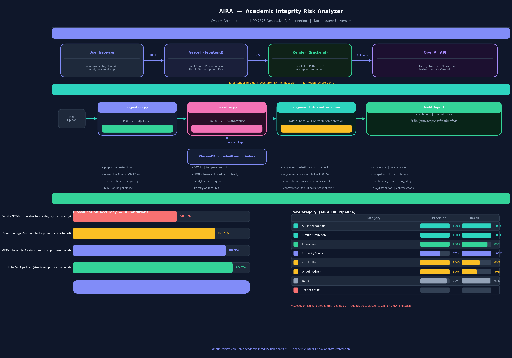

# AIRA — Academic Integrity Risk Analyzer

Audits university academic integrity policy PDFs for ambiguity, contradictions, enforcement gaps, and AI-related loopholes using GPT-4o, ChromaDB RAG, and grounded faithfulness scoring.

Built for **INFO 7375 Generative AI Engineering** · Northeastern University · Spring 2026

**Live:** https://academic-integrity-risk-analyzer.vercel.app

---

## Architecture



---

## Results

### Baseline Comparison (51-clause NEU ground truth)

| Condition | Model | Accuracy | Notes |
|---|---|---|---|
| Vanilla GPT-4o | GPT-4o (no structure) | **58.8%** | Category names only — collapses to Ambiguity/None |
| Fine-tuned mini | gpt-4o-mini (fine-tuned) | **80.4%** | AIRA structured prompt, fine-tuned model |
| GPT-4o structured | GPT-4o (AIRA prompt) | **86.3%** | Full structured prompt, base model |
| **AIRA Full Pipeline** | **GPT-4o** | **90.2%** | Full structured prompt + eval run |

**Structured prompting alone adds +27.5 percentage points** (58.8% → 86.3%). Taxonomy definitions and chain-of-thought enforcement — not model size — drive the accuracy gain.

### Per-Category (AIRA Full Pipeline)

| Category | Precision | Recall |
|---|---|---|
| AIUsageLoophole | 100% | 100% |
| CircularDefinition | 100% | 100% |
| EnforcementGap | 100% | 87.5% |
| AuthorityConflict | 67% | 100% |
| Ambiguity | 100% | 60% |
| UndefinedTerm | 100% | 50% |
| None | 91% | 97% |
| ScopeConflict | 0% | 0% — known blind spot (single-clause architecture limitation) |

### Other Metrics

| Metric | Score |
|---|---|
| Faithfulness | **100%** — every `cited_text` is a verbatim substring of its clause |
| Hallucination rate | **0.0%** — adversarial synthetic clauses (note: human review gate pending) |

---

## Documentation

| Document | Description |
|---|---|
| [SYSTEM_DESIGN_DOCUMENT.md](SYSTEM_DESIGN_DOCUMENT.md) | Full SDD — architecture, component design, API spec, design decisions, boondoggle score |
| [TECHNICAL_REPORT.md](TECHNICAL_REPORT.md) | IMRaD research paper — methods, results, baseline comparison, limitations |
| [docs/architecture.png](docs/architecture.png) | System architecture diagram |

---

## Pipeline

```
PDF → ingestion.py → List[Clause]
                          │
                  text-embedding-3-small
                          │
                      ChromaDB ──── pre-built, committed to repo
                          │
                   classifier.py ─── GPT-4o, temp=0, json_object
                          │
                   alignment.py ──── containment-first faithfulness
                          │
               contradiction.py ──── cosine sim > 0.4 pairs
                          │
                    AuditReport JSON
                          │
         FastAPI (Render) ──REST──▶ React (Vercel)
```

---

## Local Setup

### Prerequisites
- Python 3.11+
- Node 20+
- OpenAI API key

### Backend

```bash
python -m venv .venv && source .venv/bin/activate
pip install -r requirements.txt
cp .env.example .env        # add your OPENAI_API_KEY
```

PDFs used (place in `data/policies/`):

| File | Clauses | Notes |
|---|---|---|
| `neu_academic_integrity.pdf.pdf` | 51 | Demo document |
| `harvard_ai_guidelines.pdf.pdf` | 16 | AI-focused |
| `mit_handbook.pdf.pdf` | 385 | Volume testing |

**Build ChromaDB index** (run once, commit `chroma_db/`):
```bash
python build_index.py
```

**Start the API:**
```bash
uvicorn backend.main:app --reload
# http://localhost:8000
```

**Pre-compute demo outputs:**
```bash
python generate_demo.py           # NEU → demo_output.json
python generate_demo.py harvard   # Harvard → demo_harvard.json
```

### Frontend

```bash
cd frontend
npm install
npm run dev
# http://localhost:5173
```

Set `VITE_API_URL=http://localhost:8000` in `frontend/.env.local`.

### Tests

```bash
pytest tests/ -v
```

Tests use `unittest.mock` to patch `_get_client` — no API key or PDFs needed for CI.

---

## Evaluation

**Run the AIRA classifier against ground truth:**
```bash
python -m backend.evaluator
# Results → evaluation/results/run_<timestamp>.json
# Served at GET /evaluation
```

**Run the vanilla baseline (no structured prompt):**
```bash
python -m backend.baseline
# Results → evaluation/results/baseline_vanilla_gpt4o_<timestamp>.json
```

**Synthetic data** (35 clean + 21 adversarial clauses):
```bash
python -m backend.synthetic
# Review data/synthetic_clean.json and data/synthetic_adversarial.json
# Set "human_accepted": true for clauses you approve
```

---

## Fine-Tuning

AIRA fine-tunes `gpt-4o-mini-2024-07-18` on the annotated dataset as a cheaper inference alternative.

**Training data:** 69 train / 17 val examples from ground truth (51 human-annotated NEU clauses) + synthetic clean set, 80/20 split.

**Results:**

| Model | Accuracy | Cost per clause |
|---|---|---|
| GPT-4o with AIRA structured prompt | **86.3%** (44/51) | ~$0.005 |
| ft:gpt-4o-mini (fine-tuned on AIRA data) | **80.4%** (41/51) | ~$0.0002 |
| Delta | −5.9% | **~25× cheaper** |

Note: both rows use AIRA's structured prompt. The vanilla GPT-4o baseline (no prompt structure) is 58.8% — see results table above.

Fine-tuned model ID: `ft:gpt-4o-mini-2024-07-18:personal:aira:DXBLUexI`

**Run the pipeline:**
```bash
python -m backend.finetune --prepare   # build JSONL (free)
python -m backend.finetune --submit    # upload + start job (~$0.50)
python -m backend.finetune --status    # poll until succeeded
python -m backend.finetune --compare   # accuracy comparison vs GPT-4o base
```

---

## API Endpoints

| Endpoint | Description |
|---|---|
| `GET /health` | Liveness check — wake Render before demo |
| `GET /demo` | Pre-computed NEU analysis (no API cost) |
| `GET /demo/harvard` | Pre-computed Harvard analysis (no API cost) |
| `POST /analyze` | Upload PDF → AuditReport (200-clause cap) |
| `GET /evaluation` | Latest evaluation metrics JSON |
| `GET /finetune/status` | Fine-tuning job metadata and model ID |
| `GET /finetune/compare` | GPT-4o vs fine-tuned model accuracy comparison |

---

## Deployment

### Render (backend)
1. Connect GitHub repo on [render.com](https://render.com)
2. Start command: `uvicorn backend.main:app --host 0.0.0.0 --port $PORT`
3. Set `PYTHON_VERSION=3.11.0` in env vars
4. Add `OPENAI_API_KEY` in env vars

### Vercel (frontend)
1. Import repo on [vercel.com](https://vercel.com), set root directory to `frontend/`
2. Add env var: `VITE_API_URL=https://your-render-url.onrender.com`

**Before demo:** Hit `/health` at least 60 seconds before presenting — Render free tier sleeps after 15 min inactivity.

---

## Risk Taxonomy

| Category | Description |
|---|---|
| `Ambiguity` | Language open to multiple interpretations |
| `UndefinedTerm` | Key term used without definition |
| `EnforcementGap` | No mechanism to detect or act on violation |
| `ScopeConflict` | Clause applies inconsistently across contexts |
| `AuthorityConflict` | Unclear who has enforcement authority |
| `AIUsageLoophole` | AI use permitted/prohibited without clear boundary |
| `CircularDefinition` | Definition references itself |
| `None` | No risk identified |
